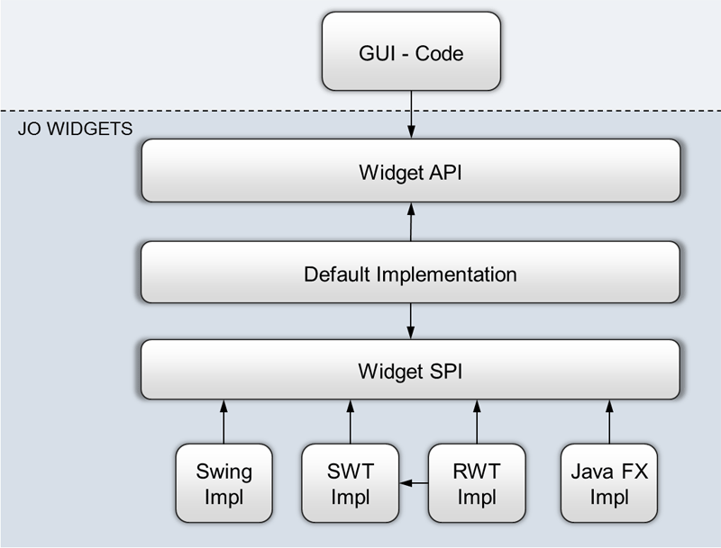
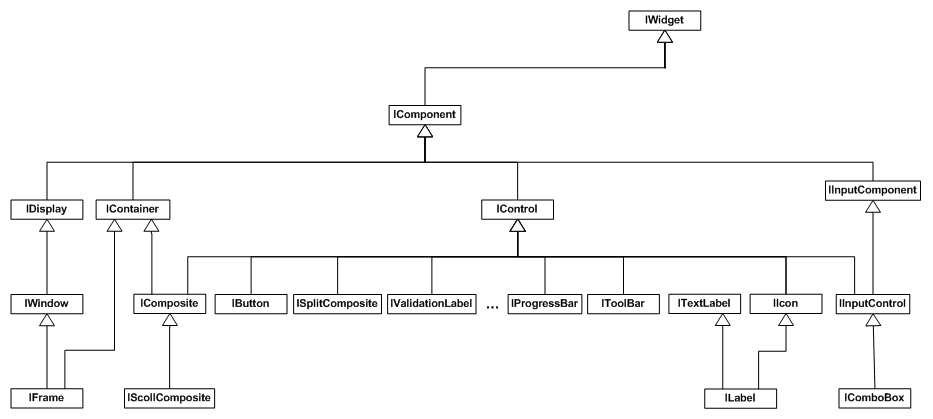
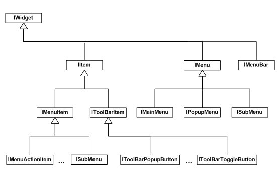

% Jowidgets Nutzerhandbuch
% Michael Grossmann
% 02. Februar 2015

# Einführung

## Lizenz

Jowidgets steht unter der [BSD Lizenz](https://www.freebsd.org/copyright/freebsd-license.html) und kann somit sowohl für kommerzielle als auch für nicht kommerzielle Zwecke frei verwendet werden.

## Übersicht

Jowidgets ist eine API zur Erstellung von graphischen Benutzeroberflächen mit Java.

Der kritische Leser stellt sich nun eventuell die Frage: "_Warum noch ein UI Framework, gibt es da nicht schon genug?_"

Die Erfahrung bei der Entwicklung von graphischen Oberflächen in unterschiedlichen Unternehmen hat gezeigt, das für viele in Unternehmen typischen Anwendungsfälle oft keine Lösungen in Standard UI Frameworks existieren, und aus dieser Not heraus das _Rad_ für diese immer wieder _neu erfunden_ wird. 

Hierzu ein kleines Beispiel. In einer Eingabemaske soll in ein Eingabefeld eine Zahl eingegeben werden. Die Eingabe soll validiert werden, und der Nutzer soll ein möglichst für ihn verständliches Feedback bekommen, wenn etwas falsch ist. Für die Eingabe bietet Swing ein `JTextField`. Dieses liefert aber einen String und keine Zahl zurück, das heißt der Wert muss erst konvertiert werden. Für die Anzeige des Validierungsfeedback könnte man in Swing ein `JLabel` verwenden. Da man Anwendungsfälle wie die Eingabe von Zahlen, Eingabe eines Datum, Anzeige von Validierungsfehlern, etc. in sehr vielen Softwarehäusern vorfindet, existieren vermutlich auch in jeder dieser firmeninternen UI Bibliothek Widgets wie: `InputNumberField`, `ValidatedInputNumberField`, `ValidatedDateField`, `ValidationLabel` usw.. Wer sich hier _wieder findet_ oder wer vielleicht selbst schon mal solch ein Widget implementiert oder verwendet hat, für den könnte jowidgets möglicherweise genau _das richtige_ UI Framework sein. 

Im Vergleich zu herkömmlichen Technologien wie _Swing_, oder _JavaFx_ liefert jowidgets kein eigenständiges Rendering für Basiswidgets ^[Wie zum Beispiel Frame, Dialog, Composite, Button, TextField, ...], sondern lediglich Adapter, welche die jowidgets Widget Schnittstellen implementieren. Dadurch ist es möglich, UI Code, welcher gegen das jowidgets API implementiert wurde, mit quasi jedem Java UI Framework auszuführen. Derzeit existieren Adapter (SPI Implementierungen, siehe  [Architektur](#architecture)) für [Swing](http://www.java-tutorial.org/swing.html), [SWT](http://eclipse.org/swt/) und [RWT](http://eclipse.org/rap/). Dadurch ist es sogar möglich, eine jowidgets Applikation als [Webapplikation](#jowidgets_rap) im Browser auszuführen. Eine _JavaFx_ Adapter Implementierung wurde im Rahmen einer Diplomarbeit prototypisch umgesetzt. Es existieren Bundle Manifeste für OSGi, so dass auch ein Einsatz in [Eclipse RCP](https://eclipse.org/) (siehe [Jowidgets und RCP](#jowidgets_rcp)) ohne weiters möglich ist.

Aufbauend auf den Basiswidgets existieren wie bereits weiter oben angedeutet zusätzliche Composite Widgets und Features, welche sich in herkömmlichen UI-Frameworks nicht finden. Zwei davon sollen an dieser Stelle exemplarisch vorgestellt werden.  

Beispielsweise gibt es ein generisches [`InputField<VALUE_TYPE>`](#input_field). Dieses hat Methoden wie `VALUE_TYPE getValue()` oder `setValue(VALUE_TYPE value)`. Für Standarddatentypen wie `Integer`, `Long`, `Double`, `Float`, `Date`, etc. existieren bereits Defaultimplementierungen. Im obigen Beispiel würde das Eingabefeld also bereits eine Zahl liefern. Mit Hilfe von Convertern kann aber auch jeder beliebige andere Datentyp unterstützt werden. Für ein `InputField` lassen sich auch beliebige Validatoren definieren. Zudem kann die UI an [`ObservableValues`](#observable_values) gebunden werden. 

Für das nächste Feature betrachten wir noch einmal das vorige Beispiel mit dem Eingabefeld von Zahlen. Für die Validierungsausgabe könnte ein ValidationLabel Widget erstellt worden sein, welches Warnungen und Fehler mit entsprechenden Icons und / oder Fehlertext anzeigen kann. Dabei kann man sowohl die Icons als auch die Farbe konfigurieren, weil Kunde A Fehler nur mit _dezenten_ Farben angzeigt bekommen möchte (laut Aussage seiner Mitarbeiter bekommt man von der standardmäßig verwendeten Farbe _Augenkrämpfe_), Kunde B kann aber Validierungsfehler, die nicht _Fett_ und _Rot_ angezeigt werden, gar nicht wahrnehmen, was die Applikation für ihn unbrauchbar macht. Stellen wir uns nun weiter vor, diese Eingabefelder und Validierungslabels sind in ein Widget mit dem Namen `GenericInputForm` eingebettet, welches sowohl von Kunde A als auch von Kunde B verwendet wird, und stellen wir uns weiter vor, dass die verwendeten Widgets noch weitere Konfigurationsattribute haben, dann müssten diese alle auch für das `GenericInputForm` konfigurierbar sein. Spätestens wenn dieses in ein weiteres Modul eingebettet ist, wird klar, dass dieses Vorgehen schnell unpraktikabel wird. 

In jowidgets ist es u.A. für solche Anwendungsfälle möglich, für jedes beliebige Widget die Defaulteinstellungen global _umzudefinieren_ (siehe dazu [Widget Defaults](#widget_defaults)). So könnte man im genannten Beispiel die gleiche Applikation einmal mit _roten_ und einmal mit _grauen_ Validierungslabels ausliefern, ohne dazu die eigentliche Applikation anpassen zu müssen. Mit der gleichen Methode könnte man zum Beispiel auch die Reihenfolge für Buttons in Eingabedialogen anpassen, definieren in welchem Format Datumswerte angezeigt werden sollen, definieren ob Buttons für Speichern und Abbrechen auf jedem Formular oder nur in der Toolbar vorhanden sind, uvm..


## Architektur {#architecture}

Die folgende Abbildung zeigt die jowidgets Architektur.



UI Code wird gegen das Widget API implementiert. Die Default Implementierung von jowidgets verwendet das Widget SPI ^[Service Provider Interface], um die Features der API zu implementieren. Für die SPI existieren Implementierungen für [Swing](http://www.java-tutorial.org/swing.html), [SWT](http://eclipse.org/swt/) und [RWT](http://eclipse.org/rap/). Die SPI Implementierungen enthalten Adapter, welche die SPI Widget Schnittstellen implementieren. 

Die Schnittstellen der SPI Widgets wurden bewusst _schlank_ gehalten, um das Hinzufügen einer neuen UI Technologie möglichst einfach zu gestalten, ohne dabei Abstriche bei der _Mächtigkeit_ der API machen zu müssen. 

Dies soll am Vergleich mit dem Eclipse Standard Widget Toolkit (SWT) erläutert werden. Dort findet man eine ähnliche Architekur. Es gibt eine API, welche für verschiedenen Platformen implementiert ist. Die Implementierungen stellen im Prinzip Adapter bereit, welche mittels JNI Methodenaufrufe an das jeweilige native UI Toolkit delegieren.  

Wer SWT kennt, weiß jedoch, dass sich die Verwendung der API zum Teil sehr _"low level" anfühlt_. Will man hingegen eine API Implementierung machen (zum Bespiel für Swing oder JavaFX), sieht aus dieser Perspektive betrachtet die API sehr _mächtig_ und komplex aus. Bei der Definition der Schnittstellen musste immer ein Kompromiss aus einfacher Implementierbarkeit und komfortabler Nutzbarkeit gemacht werden. 

Durch die Aufteilung in API und SPI kann die API _"mächtige"_ Funktionen enthalten, welche aber nur ein mal implementiert werden müssen. Auf der anderen Seite ist eine SPI Implementierung für eine neue UI Technologie keine allzu komplexes Aufgabe, was die Option bietet, geschrieben UI Code auch für zukünftige UI Technologien wiederzuverwenden.

Im diesem Kontext liegt vielleicht der Vergleich nahe, die jowidgets SPI mit SWT zu vergleichen, und die jowidgets API mit [JFace](https://wiki.eclipse.org/JFace). Dieser Vergleich ist jedoch nicht ganz korrekt, denn:

* Die jowidgets SPI muss man nicht direkt verwenden, sondern man verwendet die _high level_ Schnittstellen der API. Es gibt jedoch nicht für alle SWT Wigdets ein JFace _Pondon_. 

* Die jowidgets API bietet Funktionen, welche JFace nicht bietet. JFace bietet allerdings auch Funktionen, welche jowidgets _noch_ nicht bietet.

* Jowidgets kann auch mit Swing oder zukünftigen Ui Technologien verwendet werden. Es gibt für SWT zwar auch eine [Swing Implementierung](http://swtswing.sourceforge.net/main/index.html), diese ist aber nicht vollständig und wird seit 2007 nicht mehr gepflegt. Für zukünftige UI Technologien ist eine jowidgets SPI Implementierung weniger aufwändig als eine SWT Implementierung. Code der gegen das jowidgets API implementiert wurde, ist dadurch in gewisser Hinsicht robust gegen technologische Neuerungen. 


## Widget Paradigma

In diesem Abschnitt soll der Begriff des _Widget_ im Kontext von jowidgets definiert werden. Dazu wird zunächst ein kleiner Abstecher zur Entstehungsgeschichte gemacht.

In einem gemeinsamen Projekt zweier Unternehmen sollte ein bereits vorhandenes firmeninternes Framework neu entwickelt werden. Dieses Framework lieferte unter anderem Tabellen und Formulare für CRUD Anwendungen mit Datenbankanbindung sowie Sortierung und Filterung in der Datenbank (und nicht im Client, weil das für große Datenmengen nicht möglich ist). Bei der Neuentwicklung sollten bisherige Schwachpunkte wie eine fehlende 3 Tier Architektur, Security und eine nicht austauschbare Datenschicht optimiert werden. ^[Dieses Framework ist auch unter BSD Lizenz und findet sich hier [jo-client-platform](http://code.google.com/p/jo-client-platform/)]

Die eine Firma setzte Eclipse RCP ein und wollte daran auch nichts ändern, die andere Swing. Die neu entwickelten Module sollten aber auch für die Erweiterung bisheriger (Swing) Applikation _kompatibel_ sein und ob man zukünftig anstatt Swing SWT einsetzten wollte, war auch nicht geklärt.

So entstand die Idee, für die UI relevanten Anteile wie die `BeanTable` und das `BeanForm` Schnittstellen zu definieren. Die eine Firma implementierte dann das dazugehörige Widget für Swing, die andere für SWT. Schnell wurde klar, das diese Aufteilung zu _grob_ war, denn es entstand hauptsächlich für das Formular viel redundanter Code. Es wuchs die Begehrlichkeit, auch für Eingabefelder, Comboboxen, etc. Schnittstellen zu definieren, um das `BeanForm` auf Basis dieser implementieren zu können. Das war die _Geburtsstunde_ von jowidgets. 

Man kam zu dem Schluss, dass jede Interaktion mit dem Nutzer (HCI) durch eine Java Schnittstelle spezifiziert werden kann und soll. Dies gilt für einfache Controls wie ein `Button`, eine `ComboBox` oder ein `Eingabefeld` genauso wie für zusammengesetzte Widgets wie Beispielsweise ein Formular oder ein Dialog zur Eingabe einer Person. Während das einfache Control vielleicht eine Zahl oder einen Text liefert, liefert ein `BeanForm` ein Bean und ein `PersonDialog` ein Personenobjekt.

Das API sollte nicht nur diese einfachen und zusammengesetzten Widgets Schnittstellen bereitstellen, sondern auch eine Platform bieten um selbst eigene Widget Bibliotheken nach dem gleichen Konzept und mit dem gleichen Benefit wie anpassbaren Defaultwerten, Dekorierbarkeit, Testbarkeit, etc. zu erstellen. 

Jowidgets sollte eine __offene__, __erweiterbare__ API für Widgets in Java bieten. Der Name jowidges steht ursprünglich für _Java Open Widgets_.

>>>_Defintion: 
>>>Ein Widget ist eine Schnittstelle für den Austausch von Informationen zwischen Nutzer und Applikation_

In jowidgets werden diese Schnittstellen immer durch Java Interfaces abgebildet.


## Widget Hierarchie

Folgende Abbildungen zeigt die konzeptionelle (nicht vollständige) Widget Hierarchie von jowidgets. Widgets teilen sich auf oberster Ebene in Komponenten (Component) und Items mit Menüs auf.




Komponenten sind Fenster, Controls, Container oder InputComponents. Container enthalten Controls bzw. Controls sind Elemente von Containern. InputComponents liefern eine Nutzereingabe für einen definierten Datentyp und stellen diesen Wert dar. Dieser kann ein sowohl einfach sein (`String`, `Integer`,`Date`, ...) als auch komplex (`Person`, `Company`, `Rule`, ...). 



Items sind die Elemente von Menüs oder Toolbars. Eine MenuBar enthält Menüs.


# Getting started

## Maven

Für die Verwendung von jowidgets mit Maven muss folgendes Repository hinzugefügt werden:

~~~ {.xml}
<repositories>
    <!-- The jowidgets maven repository -->
    <repository>
        <id>jowidgets</id>
        <url>http://jowidgets.org/maven2/</url>
    </repository>
</repositories>
~~~

## Hello World

Um das Hello World Beispiel zu compilieren und auszuprobieren, sollten folgende Tools vorhanden sein:

* Java (mindestens 1.6)
* Maven
* SVN
* Eclipse (inklusive M2e maven integration)

Das Hello World Beispiel kann hier [http://jo-widgets.googlecode.com/svn/trunk/modules/helloworld](https://jo-widgets.googlecode.com/svn/trunk/modules/helloworld) per SVN ausgecheckt werden. 

Es findet sich dann die folgende Verzeichnisstruktur:


Die Module können mit __Import Existing Maven Projects__ in eclipse importiert werden. 

### Das parent Modul

Im _parent_ Verzeichnis findet sich das parent pom.xml. 

~~~ {.xml}
<project xmlns="http://maven.apache.org/POM/4.0.0" xmlns:xsi="http://www.w3.org/2001/XMLSchema-instance" 
xsi:schemaLocation="http://maven.apache.org/POM/4.0.0 http://maven.apache.org/xsd/maven-4.0.0.xsd">

	<modelVersion>4.0.0</modelVersion>
	<groupId>org.jowidgets.helloworld</groupId>
	<artifactId>org.jowidgets.helloworld.parent</artifactId>
	<version>0.0.1-SNAPSHOT</version>
	<packaging>pom</packaging>

	<properties>
		<!-- jowidgets needs java 1.6 or higher -->
		<java.version>1.6</java.version>
		<project.build.sourceEncoding>UTF-8</project.build.sourceEncoding>
		<jowidgets.version>0.40.0</jowidgets.version>
	</properties>
	
	<repositories>
	    <!-- The jowidgets maven repository -->
		<repository>
			<id>jowidgets</id>
			<url>http://jowidgets.org/maven2/</url>
		</repository>
	</repositories>
	
	<modules>
		<!-- Hold the ui technology independend hello world code -->
		<module>../org.jowidgets.helloworld.common</module>
		
		<!-- Holds a starter that uses Java Swing -->
		<module>../org.jowidgets.helloworld.starter.swing</module>
		
		<!-- Holds a starter that uses Eclipse SWT (win32) -->
		<module>../org.jowidgets.helloworld.starter.swt</module>
		
		<!-- This module creates a war that uses Eclipse RWT -->
		<module>../org.jowidgets.helloworld.starter.rwt</module>
	</modules>
	
	...

</project>
~~~

Die Hello World Applikation besteht aus vier Modulen.

* org.jowidgets.helloworld.common
* org.jowidgets.helloworld.starter.swing
* org.jowidgets.helloworld.starter.swt
* org.jowidgets.helloworld.starter.rwt

Das `common` Modul enthält den SPI unabhängigen Code, die drei anderen Module beinhalten die Starter für die jeweilige SPI Implementierung sowie die zugehörigen Maven Abhängigkeiten. 

In einem _realen_ Projekt hat man normalerweise nicht Starter für alle möglichen SPI Implementierungen. Dennoch ist es eine gute Idee, den SPI unabhängigen Code in ein separates Modul zu packen, um ihn in anderen Projekten, welche eventuell eine andere UI Technologie voraussetzen, besser wiederverwenden zu können.

### Das common Modul

Betrachten wir zunächst das _common_ pom File im Ordner `org.jowidgets.helloworld.common`. Will man die Kernfunktion von jowidgets nutzen, muss man das Modul `org.jowidgets.tools` hinzufügen.

~~~ {.xml}
<project xmlns="http://maven.apache.org/POM/4.0.0" xmlns:xsi="http://www.w3.org/2001/XMLSchema-instance"
	xsi:schemaLocation="http://maven.apache.org/POM/4.0.0 http://maven.apache.org/xsd/maven-4.0.0.xsd">
	<modelVersion>4.0.0</modelVersion>
	<artifactId>org.jowidgets.helloworld.common</artifactId>

	<parent>
		<groupId>org.jowidgets.helloworld</groupId>
		<artifactId>org.jowidgets.helloworld.parent</artifactId>
		<version>0.0.1-SNAPSHOT</version>
		<relativePath>../parent/pom.xml</relativePath>
	</parent>
	
	<dependencies>	
		<!-- The jowidgets api and tools -->
		<dependency>
			<groupId>org.jowidgets</groupId>
			<artifactId>org.jowidgets.tools</artifactId>
			<version>${jowidgets.version}</version>
		</dependency>
	</dependencies>

</project>
~~~

### Transitive Abhängigkeiten der common Moduls

In der Praxis ist jedoch immer gut zu wissen, welche transitiven Abhängigkeiten man bekommt, wenn man eine neue Technologie einführt. Jowidgets wurde bewusst so entworfen, dass (außer jowidgets selbst) __keine weiteren Abhängigkeiten__ existieren. 

Dieser Abschnitt beinhaltet Zusatzinformation, welche für das Verständnis der Hello World Applikation nicht zwingend erforderlich sind, und kann daher auch übersprungen werden. 

Das Modul __`org.jowidgets.tools`__ hat folgende Abhängigkeiten (siehe auch [Jowidgets Modulübersicht](#module_overview) im Anhang).

__org.jowidgets.util__

:   UI unabhängige Utilities und Datenstrukturen. Siehe auch [Jowidgets Utils](#jowidgets_utils).

__org.jowidgets.i18n__

:   Eine API für Multi User Internationalisierung. Da jowidgtes Web fähig ist, kann jeder Nutzer eine unterschiedliche Locale in der JVM benötigen. Daher sind alle jowidgets internen Labels mit Hilfe dieser API internationalisiert. Die API kann aber auch für eigene Projekte genutzt werden. Siehe auch [i18n](#jowidgets_i18n).

__org.jowidgets.classloading.api__

:   API mit dessen Hilfe man ClassLoader registrieren kann. Dies ist hauptsächlich für die OSGi Kompatibilität notwendig. Siehe auch [Jowidgets Classloading](#jowidgets_classloading).

__org.jowidgets.validation__

:   Eine (UI unabhängige) API für Validierung.

__org.jowidgets.validation.tools__

:   Vorgefertigte Validatoren.

__org.jowidgets.unit__

:   Eine (UI unabhängige) API für das Rechnen mit Einheiten (z.B. Hz, Byte, KG, etc.).

__org.jowidgets.common__

:   Gemeinsame Schnittstellen und Klassen der API und der SPI.

__org.jowidgets.api__

:   Die jowidgets API welche überwiegend aus Java Interfaces besteht.

__org.jowidgets.tools__

:   Während die API überwiegend aus Schnittstellen besteht, finden sich hier nützliche Klassen, welche sich aus den Schnittstellen ergeben, wie zum Beispiel Default Implementierungen, abstrakte Basisklassen, Wrapper, Listener Adapter und weitere. 


### Der Common Ui Code

Die Klasse `HelloWorldApplication` sieht wie folgt aus:

```{.java .numberLines startFrom="1"} 
package org.jowidgets.helloworld.common;

import org.jowidgets.api.toolkit.Toolkit;
import org.jowidgets.api.widgets.IButton;
import org.jowidgets.api.widgets.IFrame;
import org.jowidgets.api.widgets.blueprint.IButtonBluePrint;
import org.jowidgets.api.widgets.blueprint.IFrameBluePrint;
import org.jowidgets.common.application.IApplication;
import org.jowidgets.common.application.IApplicationLifecycle;
import org.jowidgets.common.types.Dimension;
import org.jowidgets.common.widgets.controller.IActionListener;
import org.jowidgets.common.widgets.layout.MigLayoutDescriptor;
import org.jowidgets.tools.widgets.blueprint.BPF;

public final class HelloWorldApplication implements IApplication {

	@Override
	public void start(final IApplicationLifecycle lifecycle) {

		//Create a frame BluePrint with help of the BluePrintFactory (BPF)
		final IFrameBluePrint frameBp = BPF.frame();
		frameBp.setSize(new Dimension(400, 300)).setTitle("Hello World");

		//Create a frame with help of the Toolkit and BluePrint. This convenience
		//method finishes the ApplicationLifecycle when the root frame will be closed.
		final IFrame frame = Toolkit.createRootFrame(frameBp, lifecycle);

		//Use a simple MigLayout with one column and one row for the frame (a frame is a container also)
		frame.setLayout(new MigLayoutDescriptor("[]", "[]"));

		//Create a button BluePrint with help of the BluePrintFactory (BPF)
		final IButtonBluePrint buttonBp = BPF.button().setText("Hello World");

		//Add the button defined by the BluePrint to the frame
		final IButton button = frame.add(buttonBp);

		//Add an ActionListener to the button
		button.addActionListener(new IActionListener() {
			@Override
			public void actionPerformed() {
				System.out.println("Hello World");
			}
		});

		//set the root frame visible
		frame.setVisible(true);
	}
}
```
    


## BluePrints

## Layouting

### Mig Layout

### Custom Layout Managers

## Menu Items

## Menu Models

## Actions und Commands

## ObervableValues {#observable_values}


# Basis und Composite Widgets 

## Frame

## Dialog

## Composite

## ScrollComposite

## SplitComposite

## ExpandComposite

## TabFolder

## TextLabel

## Label

## Icon

## Button

## ToggleButton

## TextField

## TextArea

## InputField {#input_field}

## InputDialog

## ValidationLabel

## CheckBox

## Combobox

## ComboboxSelection

## Slider

## SliderViewer

## Tree

## Table

## Calendar

## Separator

## TextSeparator

## ProgressBar

## Levelmeter

## Canvas

## Toolbar

## MessageDialog

## QuestionDialog

## PopupDialog

## FileChooser

## DirectoryChooser

## LoginDialog

## PasswordChangeDialog

## Menu

## PopupMenu

## Toolbar

## MenuItems


# Addon Widgets 

## SwtAwtControl

## AwtSwt Control

## OleControl

## OfficeControl

## PdfReader

## Mediaplayer

## Browser

## DownloadButton

## Map

# Jowidgets Workbench

# Jowidgets Utils {#jowidgets_utils}

# Weiterführende Themen

## Validierung

## i18n {#jowidgets_i18n}

## Widget Defaults {#widget_defaults}

## Widget Dekorierung

## Erstellung eigener Widget Bibliotheken

## Automatisierte GUI Tests

## Jowidgets und RAP {#jowidgets_rap}

## Jowidgets Classloading{#jowidgets_classloading}

## Jowidgets und RCP {#jowidgets_rcp}


# Anhang

## Modulübersicht {#module_overview}


